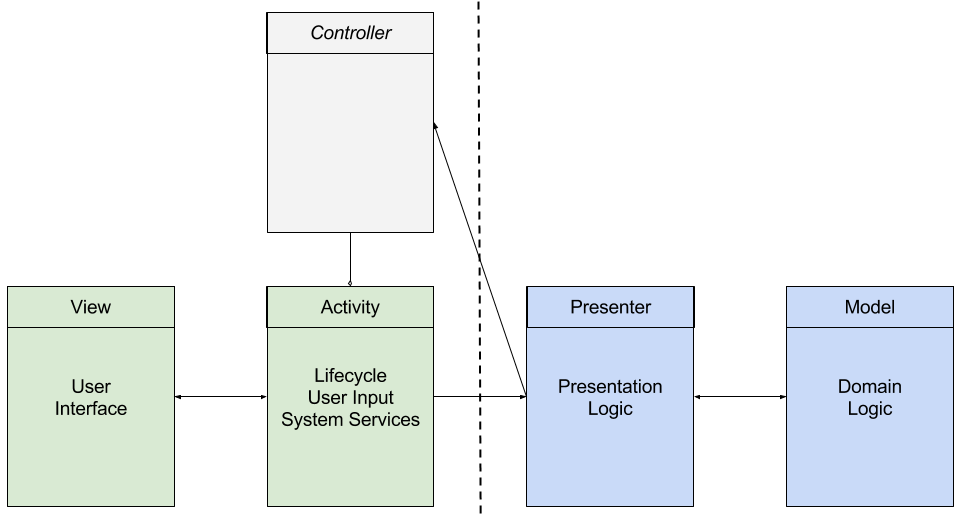
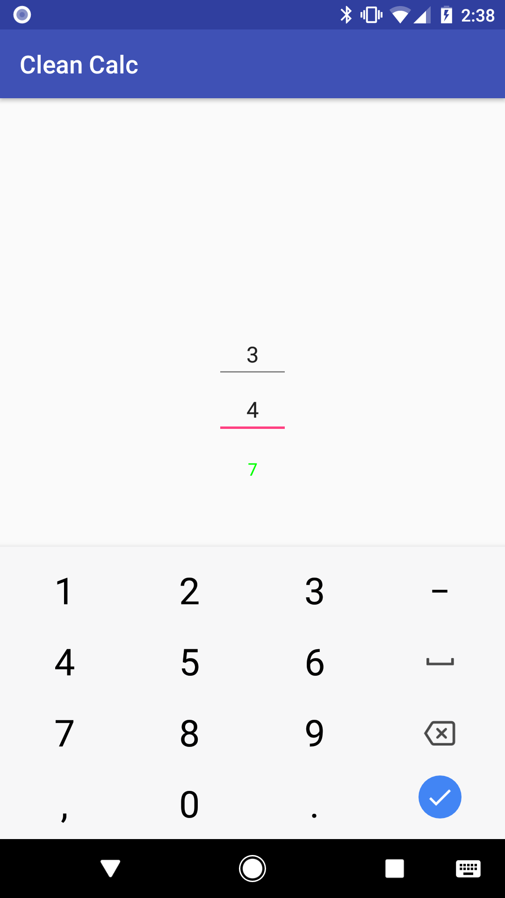
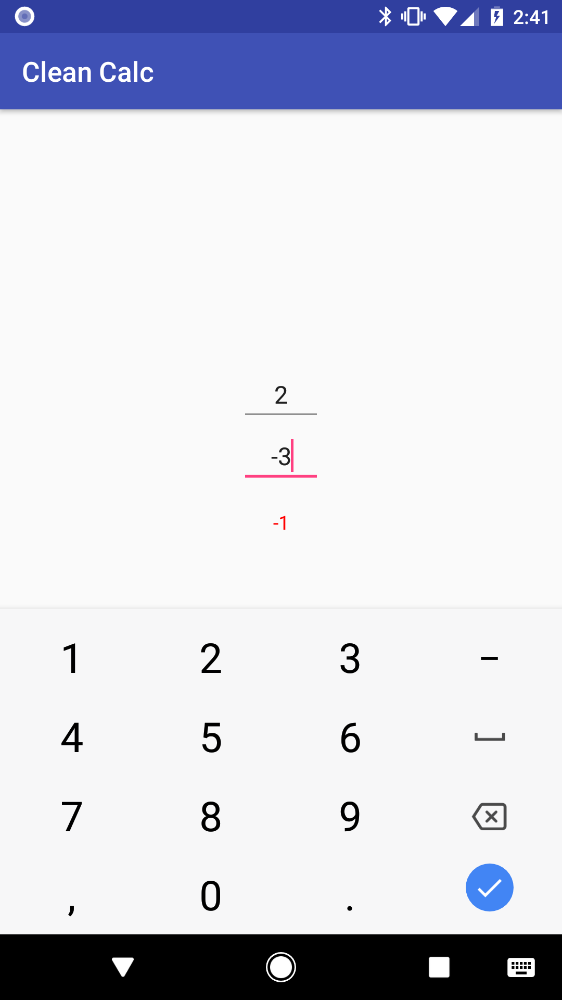

# Clean Calc
Simple finance calculator demo app to showcase Android clean architecture principles and testing strategies.

## Blog
https://medium.com/android-testing-daily

## MVP(C)
This app uses a modified version of MVP that introduces a `Controller` interface for communcation between the presenter and the activity.

Android framework dependencies are scoped to the view layer only. View composition and logic is kept separate from the activity.

The presenter and domain model are pure Java objects.

## Screenshots
A new sum is calculated and displayed whenever the user enters a new value in either input text field.

Positive values are color coded in green.

Negative values are color coded in red.

## Requirements
* Android Studio 3.0
* API 26
